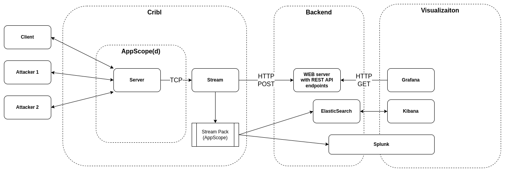

# appscopepackdemo

1. Load the example pack https://github.com/michalbiesek/appscopepack
2. Set Node Graph API to following plugin http://http_proxy1:5000/

## Overview

The diagram below depicts the demo cluster.

|Service|URL|
|-------|---|
|Cribl Stream|[http://localhost:9000](http://localhost:9000)| user `admin` password `admin`
|Grafana|[http://localhost:3000](http://localhost:3000)| user `admin` password `scopedemo`
|Splunk|[http://localhost:8000](http://localhost:8000)| user `admin` password `scopedemo`
|Kibana|[http://localhost:5601](http://localhost:5601)|

Screenshots:

